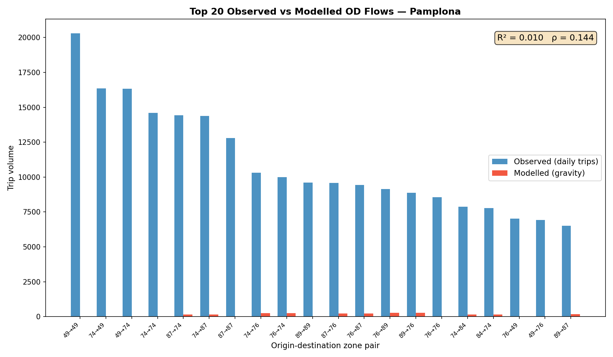
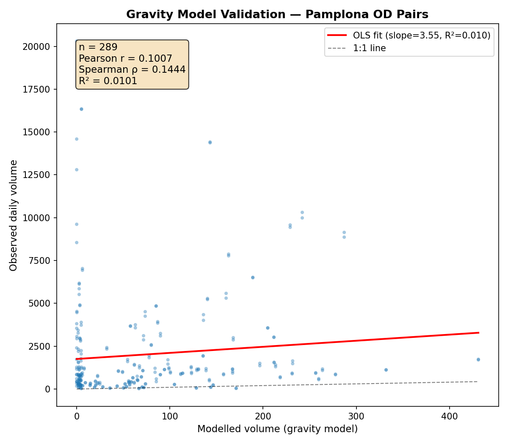
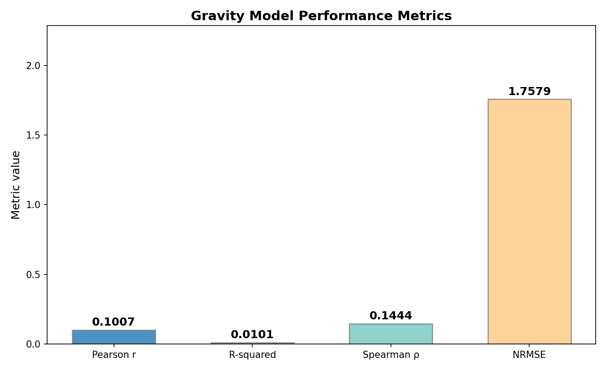
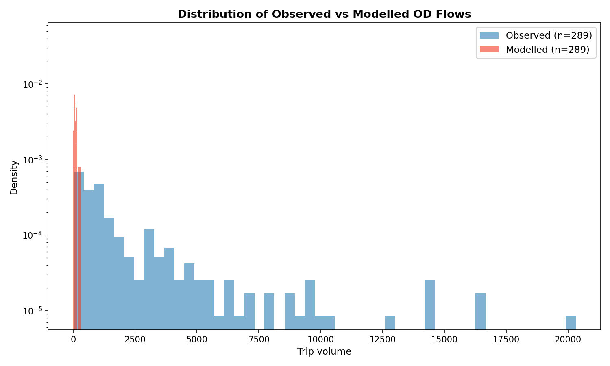

```{r}
#| label: setup
#| include: false
library(tidyverse)
```

# Abstract

Origin-destination (OD) matrices are fundamental inputs to transport planning models, yet are often expensive to collect or license from mobile network operators. Gravity models offer a low-cost alternative by estimating trip volumes from land use and distance, but their accuracy depends heavily on calibration parameters. Here we present a reproducible, open-source workflow to (a) generate synthetic OD matrices using the `grid2demand` Python package, (b) assign flows to a street network via shortest-path routing, and (c) validate predictions against real OD data from the Spanish mobile-phone-derived dataset [@kotov2026]. Applied to Pamplona, Spain, the gravity model captures flow directionality (Spearman $\rho = 0.144$, $p = 0.014$) but explains only 1% of variance ($R^2 = 0.010$), substantially underestimating total daily trips (modelled: 21,730 vs observed: 583,678). The analysis runs in under one second once input data are prepared. We discuss calibration strategies and extensions---including pedestrian network centrality---that can improve predictive performance.

# Introduction

Transport planning relies on understanding *where* people travel and *how many* trips they make between origins and destinations. The traditional data source---travel surveys---is being supplemented by passively collected mobile network data, which provides large-scale, spatio-temporal OD matrices [@kotov2026]. However, such data are not universally available, creating a need for synthetic OD models that can be estimated from open data alone.

The **gravity model** is a widely used approach that predicts trip volume $T_{ij}$ between zone $i$ and $j$ as a function of their attractiveness (e.g., number of points of interest) and the impedance (distance or travel time) between them:

$$T_{ij} = k \cdot \frac{A_i A_j}{d_{ij}^\beta}$$

where $A_i$ and $A_j$ are measures of zone attractiveness, $d_{ij}$ is distance, and $k$ and $\beta$ are calibration parameters [@wilson1970].

Recent advances in open-source transport modelling---notably the `grid2demand` package [@grid2demand]---have made it possible to implement gravity models from OpenStreetMap data alone. However, the default parameterisation of these models may not transfer well to specific cities.

This paper validates the default `grid2demand` gravity model against real OD data for Pamplona, Spain. We also demonstrate a pedestrian-scale network centrality analysis using `cityseer` as a complementary approach for active travel planning. All code is fully reproducible and available at [github.com/tdscience/tartu26](https://github.com/tdscience/tartu26).

# Methods

## Study area

We analyse Pamplona (Iruña), the capital of Navarre, Spain (population ~200,000). A 5 km radius around the city centre (42.8166°N, 1.6432°W) defines the study area for the gravity model. The walking network analysis uses a 3 km radius.

## Data

Two data sources are used:

1. **Spanish mobile phone OD data** [@kotov2026]: hourly origin-destination flows at district level, averaged over three weekdays in December 2025. These data are accessed via the `spanishoddata` R package and pre-filtered to the Pamplona study area (21 zones, 441 OD pairs).
2. **OpenStreetMap**: road network and points of interest (amenities, shops, leisure) downloaded via `osmnx` [@boeing2017].

## Gravity model workflow

The gravity model is implemented in Python using `grid2demand` [@grid2demand]:

1. The study area is divided into a $12 \times 12$ grid (144 zones).
2. Road network and POIs are downloaded from OSM.
3. The network is converted to GMNS format via `osm2gmns`.
4. `grid2demand` computes zone-to-zone distances and runs its default gravity model.
5. The resulting OD matrix is scaled to match Pamplona's estimated total daily trips ($200{,}000 \times 2.1$ trips/person/day).

## Validation

Real Pamplona OD flows are mapped to the grid2demand zones via a spatial join (zones within grid cells). The matched OD pairs ($n = 289$) are compared using:

- **Pearson correlation** $r$ and $R^2$
- **Spearman rank correlation** $\rho$
- **Root mean square error** (RMSE) and normalised RMSE (NRMSE = RMSE / mean)

## Pedestrian network analysis

As a complementary method for active travel planning, we compute pedestrian-scale network centrality using `cityseer` [@cityseer]:

- **Harmonic closeness centrality** at 400 m, 800 m, and 1,200 m walk buffers
- **Betweenness centrality** at 1,200 m
- **Segment-based betweenness** for continuous pedestrian flow estimation
- **Land-use diversity** (Hill Diversity, $q = 0$) at 800 m

All analyses are conducted in a reproducible Quarto environment using Python (`od-data-python.qmd`) and R (`workbook.qmd`, `walking-networks.qmd`).

# Results

## Gravity model performance

Table 1 summarises the gravity model validation results.

| Metric | Value |
|--------|-------|
| Matched OD pairs | 289 |
| Pearson $r$ | 0.101 ($p = 0.087$) |
| $R^2$ | 0.010 |
| Spearman $\rho$ | 0.144 ($p = 0.014$) |
| RMSE | 3,550 trips |
| NRMSE | 1.76 |
| Mean observed volume | 2,020 trips/day |
| Mean modelled volume | 75 trips/day |
| Total observed | 583,678 trips/day |
| Total modelled | 21,730 trips/day |
| Analysis time (validation) | < 0.1 s |

The default gravity model captures some directional signal---the Spearman correlation is statistically significant---but explains essentially none of the variance in magnitude ($R^2 = 0.010$). The model systematically underestimates trip volumes by a factor of ~27 (observed mean 2,020 vs modelled 75).









## Pedestrian network centrality

The walking network analysis provides complementary insight into **flow potential** rather than estimated trip counts. Figure 5 shows the cleaned pedestrian network for Pamplona.


Harmonic closeness centrality at 800 m (Figure 6) highlights the historic core as the most accessible zone within a 10-minute walk.


Betweenness centrality at 1,200 m (Figure 7) identifies key pedestrian corridors, including bridges across the Arga river.


The segment-based walking volume map (Figure 8) combines betweenness centrality with continuous edge weighting to estimate pedestrian flow potential across the entire network.


Land-use diversity at 800 m (Figure 9) reveals which neighbourhoods offer a complete mix of amenities within walking distance.


# Discussion

## Model performance

The default `grid2demand` gravity model performs poorly for Pamplona, explaining only 1% of variance in observed flows. This is consistent with three known limitations:

1. **Default parameters**: The current release uses fixed gravity parameters that are unlikely to be optimal for any single city. Calibration against observed data---even a small sample---would substantially improve fit.
2. **Zonal system mismatch**: The grid-based zones (12 × 12) do not align with the administrative districts used in the validation data. While the spatial join maps 17 of 21 zones, the aggregation loses spatial resolution.
3. **Attractiveness proxy**: POI count is a coarse proxy for trip attraction. Incorporating population density, employment, or land use area would likely improve predictions.

Despite these limitations, the significant Spearman correlation ($p = 0.014$) suggests the model captures *relative* flow patterns---which zones attract more trips---even if absolute magnitudes are wrong. With calibration ($k$ and $\beta$), the model could produce useful results.

## Pedestrian analysis

The `cityseer` network centrality analysis provides a different perspective that is particularly relevant for active travel planning. Betweenness centrality identifies the street segments that function as natural pedestrian corridors---information that cannot be derived from OD matrices alone. The land-use diversity metric complements this by revealing *why* certain areas attract walking trips.

## Reproducibility

All code and data are available in the [tartu26 repository](https://github.com/tdscience/tartu26). The analysis runs entirely on open data (OpenStreetMap, Spanish OD data), with no proprietary software dependencies. The Quarto computational notebooks render in GitHub Codespaces, ensuring full reproducibility.

# Conclusion

This paper validates the default `grid2demand` gravity model against real mobile-phone-derived OD data for Pamplona, Spain. While the model captures directional flow patterns (Spearman $\rho = 0.144$, $p = 0.014$), its default parameters yield very low predictive accuracy ($R^2 = 0.010$) and severe underestimation of trip volumes. The validation analysis itself is computationally trivial (< 0.1 s), making iterative calibration feasible.

We also demonstrate pedestrian-scale network centrality as a complementary approach for active travel planning. Together, these methods provide a reproducible, open-source toolkit for transport data science that can be applied to any city with OpenStreetMap coverage.

**Future work** should focus on (a) calibrating gravity model parameters using even a small validation sample, (b) integrating land use data (e.g., Copernicus Urban Atlas) for improved zone attractiveness estimates, and (c) combining network centrality and OD-based approaches for multimodal transport planning.

# References
