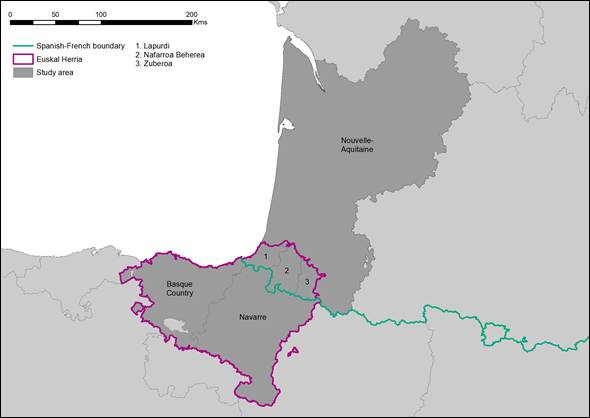
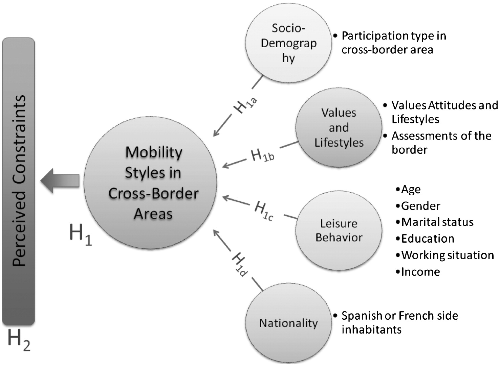
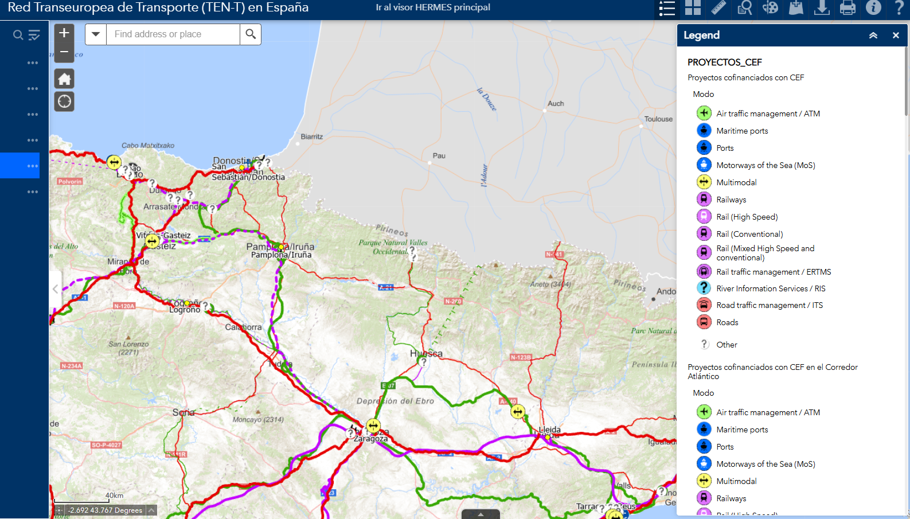
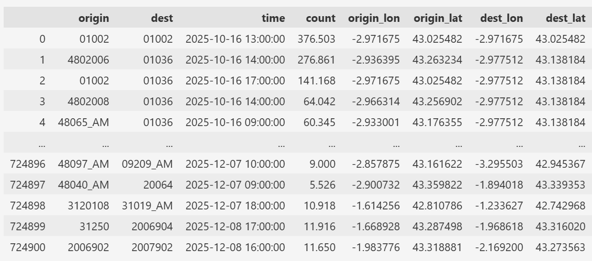
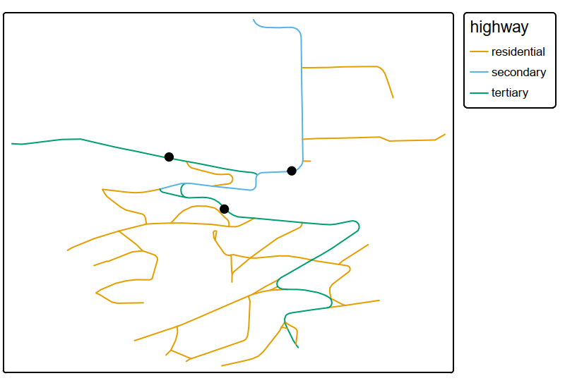
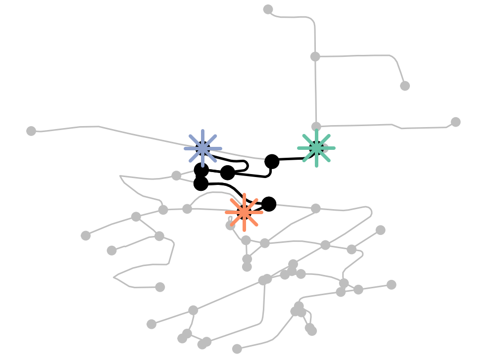

## Team Members

- **Eva Hajčiarová** - *PhD student / Applying routing analysis to local context*
- **Paul Bairoh** - *PhD student / Quarto "expert" and GIS specialist*
- **Allison Fernández-Lobo** - *PhD student / Intermodality and cross-border mobility*
- **Juliette Le Corguillé** - *PhD student / Accessibility and public transportation*

## Research interests - Cross-border trips in North-Eastern Spain to Southern France

- Cross-border trips
  - Who travels and when?
- How does the France-Spain border affect mobility patterns in the Basque Country?
  - What are the barriers and opportunities for cross-border mobility in this region?

## Border as a potential barrier for the inhabitants of the Basque Country?

{fig-align="center"}

Amado, A., Paül, V., & Trillo-Santamaría, J. M. (2024).

## What affects cross-border mobility?

{fig-align="center"}

Guereño-Omil, B., Hannam, K., & Alzua-Sorzabal, A. (2014).

## Study Area: TENT Network in Spain

{fig-align="center"}

## Research Questions

- What are the cross-border mobility patterns in this region?
  - What are the peak commuting hours during weekdays and typical leisure travel hours on the weekend?
- What kind of differences are there in the demographics of those doing cross-border commuting and those doing cross-border leisure trips?
  - Comparing patterns by income, gender, age (control variables)

## Planned methodology (1)
1. Dataset 
{fig-align="center"}

## Planned methodology (2)
2. Data analysis
- Compare socioeconomic characteristics of the people doing cross-border trips vs those doing domestic trips

3. Routing analysis
- Connect local data (traffic survey measurement points) from Prague Strahov area to the map layer, perform simple routing analysis on the local data and visualise the results. 

## Routing results
{fig-align="center"}

## Routing results

{fig-align="center"}

## References

- Amado, A., Paül, V., & Trillo-Santamaría, J. M. (2024). The cross-border dimension of regional and urban planning in the greater Basque country (Spain-France). Estudios fronterizos, 25.

- Guereño-Omil, B., Hannam, K., & Alzua-Sorzabal, A. (2014). Cross-border leisure mobility styles in the Basque Eurocity. Leisure Studies, 33(6), 547–564. https://doi.org/10.1080/02614367.2013.833282
