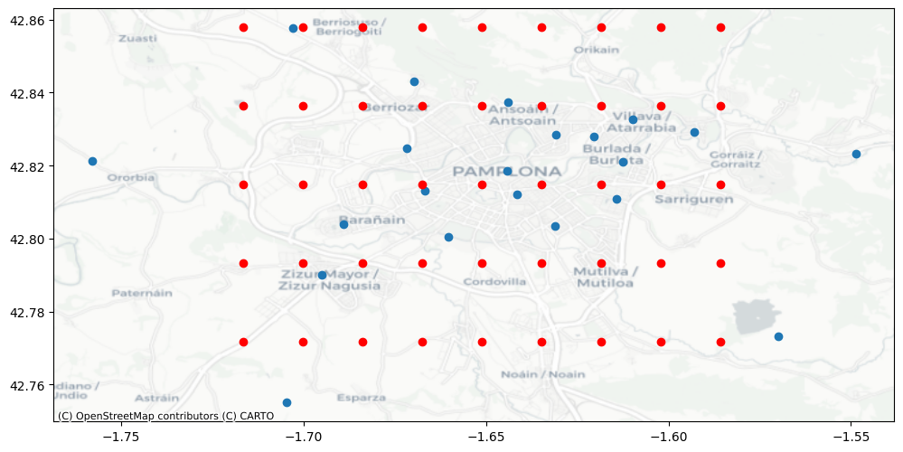
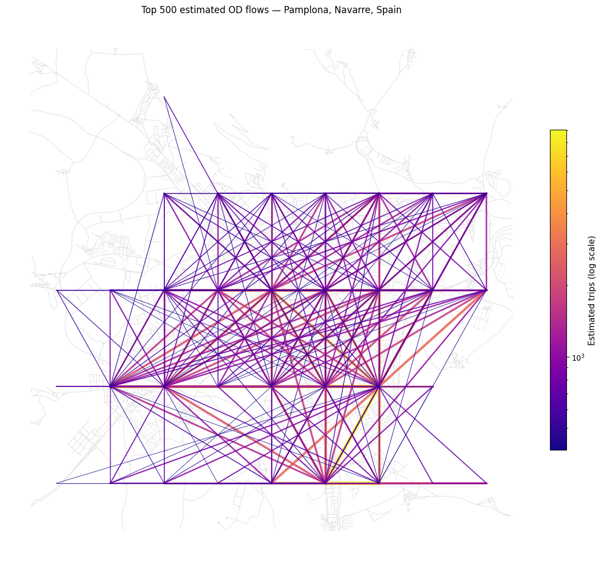
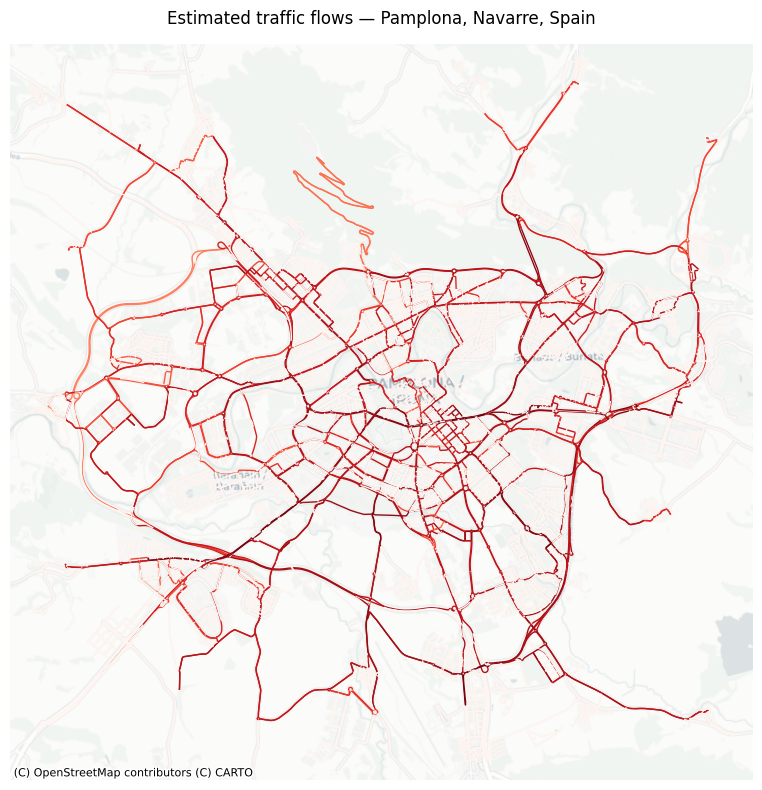

## Team Members

- **Jonas** - *Researcher / Intra-household interactions in mobility behaviour*
- **Helen** - *Researcher / Active mobility route choice*
- **Xiao** - *Researcher / Synthetic cycling flows*
- **Jaanika** - *Researcher / Social groups as lever for sustainable mobility change*
- **Keren Or** - *Researcher / Climate effects on travel mobility*

## Data

We used the following Datasets:

- Spanish Origin-Destination Data (via [spanishoddata](https://ropenspain.github.io/spanishoddata/) package)
- Bikesharing trip data from Dresden (from [european-bike-sharing-dataset](https://github.com/TUMFTM/european-bike-sharing-dataset))
- OpenStreetMap

## Selected Project Ideas

We all just tried out different things, but this are some questions we tried to answer:

- What trip purposes dominate for cross-border trips between Spain and France?
- How does a public transport strike effect bikesharing usage?
- How easy is it to get a routable cycling network from OpenStreetMap?
- How can we improve the performance of the existing grid-based OD flows workbook?

## Trip purposes for cross-border trips between Spain and France

What is the dominant trip purpose (work/study-related, leisure) for the cross-border trips between Spain and France?

## Trip purposes for cross-border trips between Spain and France

Same question using National OD week dataset (previous file version)

## Influence of a public transport strike on bikesharing

Aggregated origin-destination flows of bikesharing trips in Dresden on 2 March ("normal" Thursday) 

## Influence of a public transport strike on bikesharing

Aggregated origin-destination flows of bikesharing trips in Dresden on 3 March (Friday, 24 h public transport strike) 

## Generating a routable cycling network

This network took less than one hour to get with no previous knowledge of the [osmextract](https://docs.ropensci.org/osmextract/articles/osmextract.html) package. And it looks quite reasonable, even though goo routing is another question.

## OD-to-flows pipeline

- Grid-based OD estimation in Pamplona (`grid2demand`)
- Demand dictated by POIs
- Validation results:
  - Pearson correlation: 0.1
  - Spearman correlation: 0.14

## Improving the pipeline

- Experimenting with different parameters (e.g. scaling factor, number of flows included)
- Adding different POIs
- ~~Increasing the grid resolution~~
- **Decreasing the grid resolution** - 9x5

## Estimated flows

## Routed flows

## Validation results

- Pearson correlation: 0.1 → **0.11**
- Spearman correlation: 0.14 → **0.39**

- Spearman correlation is improving, suggesting that the ranking of flows is more accurate
- Further improvements: adjusting the scaling factor, aligning the grid with the validation zones, adding more POIs, etc.
