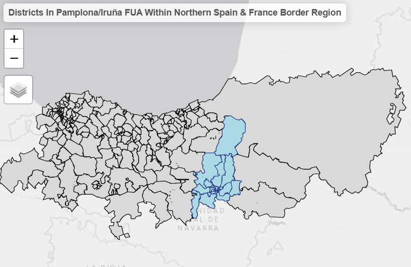
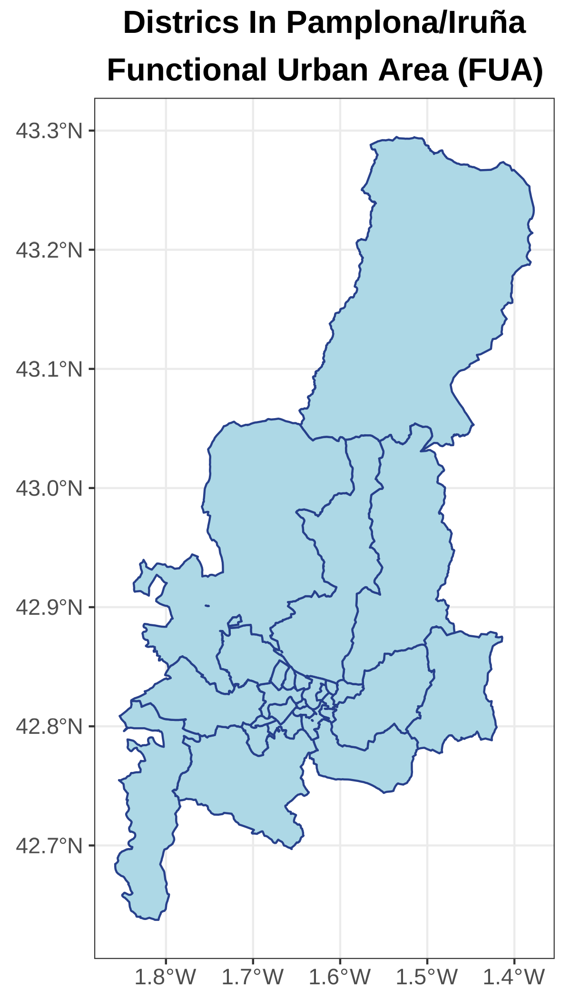
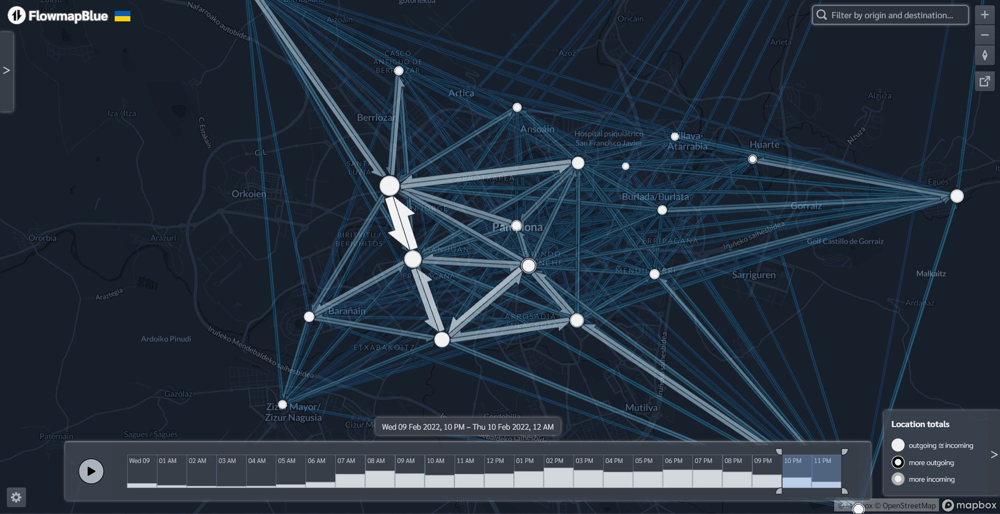
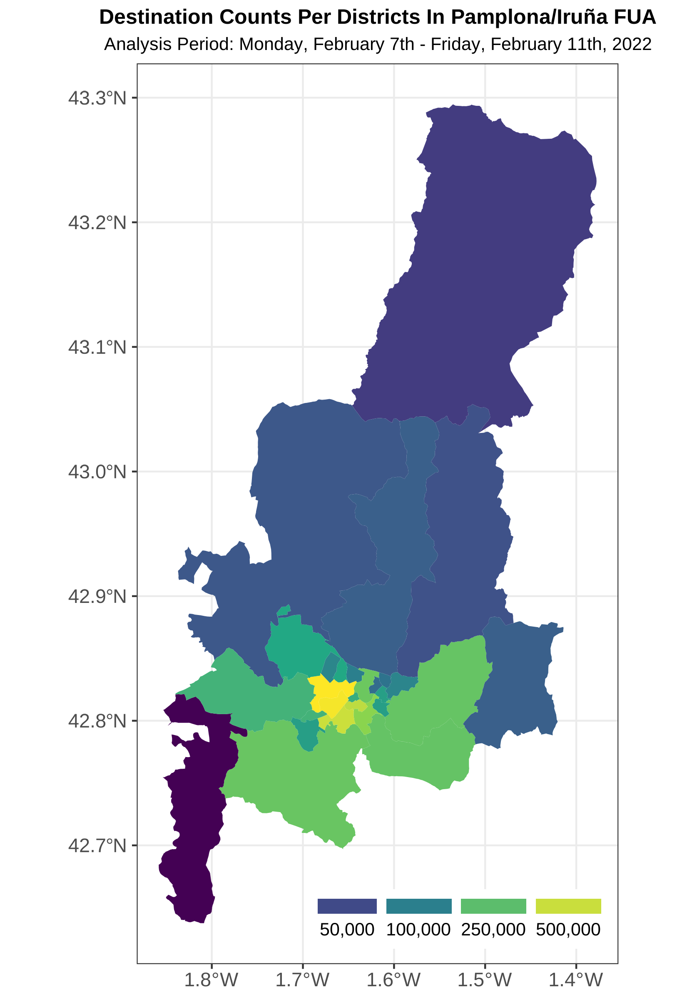
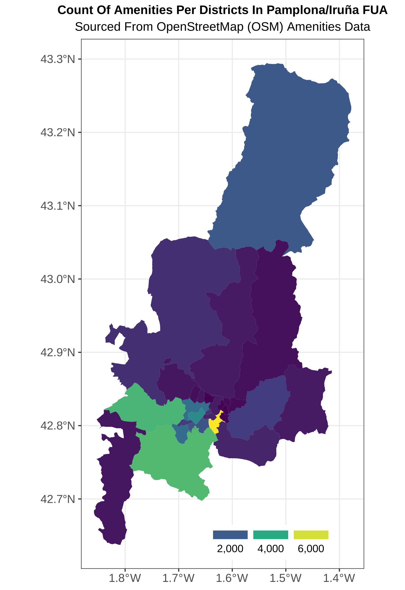
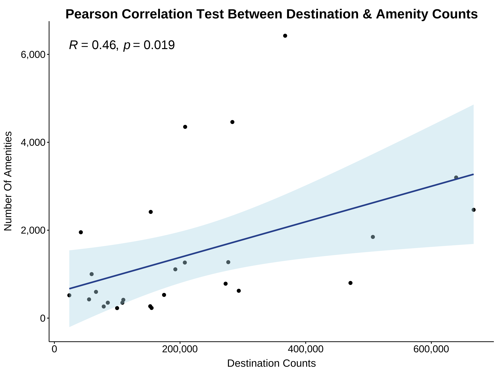

## Research Question

```{=html}
<style>
   .reveal .title {
    font-size: 1.5em !important;
  }
  .quarto-title-author-name {
    font-size: 0.6em;
  }
  .date {
    font-size: 0.5em;
  }
  .subtitle {
    text-align: center;
    font-size: 0.9em; /* Increase or decrease this number to adjust size */
  }
</style>
```

::: {style="text-align: center; font-size: 1.2em;"}
Could we infer if the mobility of people is driven by the availability of amenities in a given area?
:::

## Scope Of Analysis (1/2)

{width="650" fig-align="center"}

## Scope Of Analysis (2/2)

{width="400" fig-align="center"}

## Interactive OD Flows (1/2)

[Pamplona's OD Flows (Wednesday, February 9th, 2022)](https://www.flowmap.blue/1s0fymrh8YdN2PMtfyWcCi-I_0v74KIBK5TTKGMHC4H4?v=42.813682%2C-1.647666%2C12.28%2C0%2C0&a=0&as=1&b=1&bo=75&c=1&ca=1&d=1&fe=1&lt=1&lfm=ALL&t=20220209T220000%2C20220210T000000&f=50)

{fig-align="center"}

## Interactive OD Flows (2/2)

::: {.r-stretch}
<iframe 
  src="https://www.flowmap.blue/1s0fymrh8YdN2PMtfyWcCi-I_0v74KIBK5TTKGMHC4H4/embed"
  width="100%" 
  height="100%"
  frameborder="0" 
  allowfullscreen>
</iframe>
:::

## Destinations & Amenities

::: {layout-ncol="2"}
{width="400" fig-align="center"}

{width="400" fig-align="center"}
:::

## Pearson Correlation Test

{fig-align="center"}
