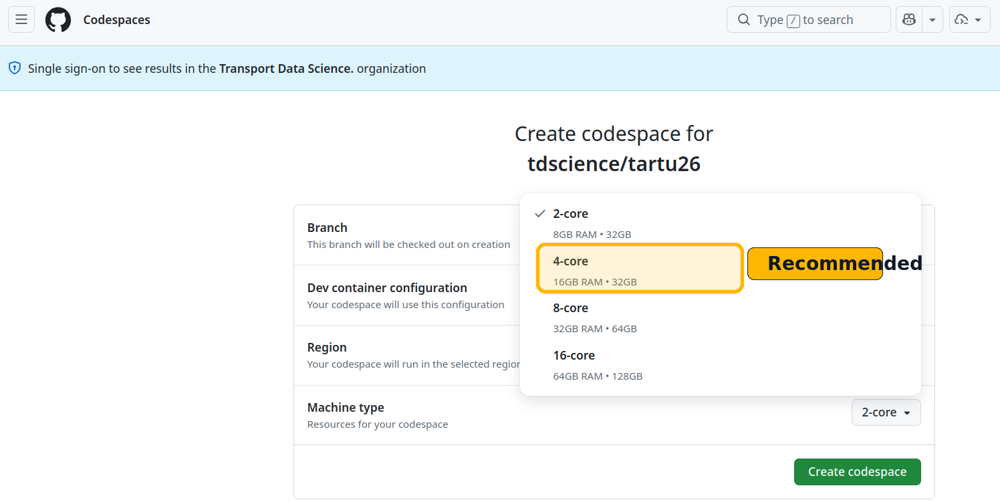
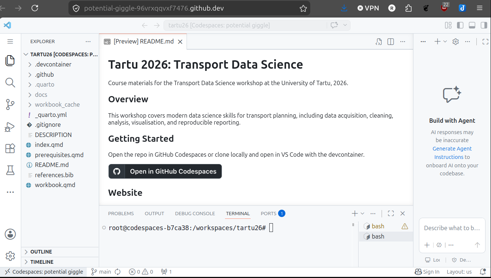
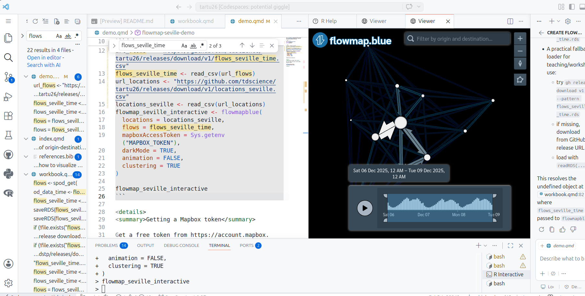

## Introduction {#sec-intro}

Welcome to the Mobile Tartu 2026 Transport Data Science workshop!
This document outlines the prerequisites for the workshop.
There are two main ways to run the workshop materials:

1.  **Cloud-based setup** using GitHub Codespaces, Posit Cloud, or similar services (see @sec-cloud).
2.  **Local setup** on your computer (see @sec-local).

Within each approach, there are various options for software and data setup.

Which to use?
It depends:

-   If you want the fastest and easiest way to get started, the cloud-based option is recommended.
-   If you prefer to work on your own machine, want to learn about installing and setting-up software for future use, and have a decent laptop that you have admin rights for, the local setup is a good option.

If in doubt, start with the cloud-based option to get going quickly, and then explore the local setup if you want to learn more about the software and data management aspects.
Whichever option you choose, ensure you have a good handle on the software and data setup before the workshop to make the most of the session.

At a minimum, you should be able to reproduce the figure show at the end of this document, which is an interactive flow map of Seville using the `spanishoddata` package.

## Cloud Setup {#sec-cloud}

For the cloud-based option, you can run the workshop environment entirely in your web browser.
This is the fastest and easiest way to get started.

### GitHub {#sec-github}

To use GitHub Codespaces or access repository resources, you must have a GitHub account.
Go to [GitHub](https://github.com) and sign-up if you haven't already done so.

After you have a GitHub account, you can launch the workspace in GitHub Codespaces by clicking the badge below.
**Note: it takes around 5 minutes to set up the Codespace environment, so be patient, read-up on some of the links in this website, or get a coffee!**

[](https://codespaces.new/tdscience/tartu26?quickstart=1)

When you click on that button, assuming you're signed in and do not have any existing codespaces associated with the repo already running, you should see a page with default settings for the codespace.
You can leave them all as is **except for machine type**.

We will be handling a lot of data so **select the 4-core option**.
This gives you 16 GB RAM on a machine with 60 hours of [free use per month](https://docs.github.com/en/billing/concepts/product-billing/github-codespaces#free-quota).
That should be plenty for processing the datasets we'll using in this tutorial.
Go for a larger option if you want to import larger datasets but be warned that your compute credits will burn down quicker the larger the machine you're on, as described in the [GitHub Codespaces pricing docs](https://docs.github.com/en/billing/concepts/product-billing/github-codespaces).



<details>

<summary>About GitHub</summary>

While you wait for that to load, it's worth learning a bit about what GitHub is: it's the world's number one platform for hosting and collaborating on code, especially for international and open-source projects, although you can easily host 'private repos' also, allowing you to choose who can see and collaborate on your work.
Key concepts in GitHub include:

-   Repositories, also called repos. These are like folders for your projects, where you can store code, data, and documentation. The workshop materials are hosted in a GitHub repository. See the [GitHub repository for the workshop at github.com/tdscience/tartu26](https://github.com/tdscience/tartu26) for more details.
-   Issues. These are like to-do lists or bug trackers for your code. You can use them to keep track of tasks, bugs, or feature requests for your projects. See the [Issues tab in the workshop repository](https://github.com/tdscience/tartu26/issues) and open a test issue if you want to practice, it's a great way to communicate, learn, get feedback and collaborate with others.
-   Pull requests. These are like proposals for changes to your code. You can use them to suggest changes, review code, and merge changes into your projects. See the [Pull Requests tab in the workshop repository](https://github.com/tdscience/tartu26/pulls) for more details. Bonus: open a PR making a change to the README file, it's a great way to practice and learn about how PRs work (see the [GitHub documentation on pull requests](https://docs.github.com/en/pull-requests) for more details).
-   Commits. These are like snapshots of your code at a given point in time.
-   Branches. These are like different versions of your code that you can work on separately and then merge together.

You can run the code in any GitHub repo in Codespaces by clicking on the green "Code" button and selecting "Open with Codespaces", as described in the [GitHub documentation](https://docs.github.com/en/repositories/creating-and-managing-repositories/cloning-a-repository) and shown below.
Try to see the options in the green "Code" button for the [workshop repository](https://github.com/tdscience/tartu26), and try cloning locally or downloading the zip file to see the different options available as a bonus.
The "Codespaces" option is the one to launch the cloud-based environment for the workshop, while the "Download ZIP" option allows you to download the repository files to your local machine without using Git.

{width="50%"}

The "Local" clone --- with HTTPS, ssh or GitHub CLI options --- are for cloning the repository to your local machine, which is not required if you are using Codespaces, but may be useful if you want to work on the materials locally, as described in @sec-local.

</details>

After the Codespace has finished 'spinning-up', you will see something like this:



There are a few things worth noting about the Codespace environment shown above:

1.  The repository files are visible in the Explorer pane on the left (including `.devcontainer`, Quarto files, and workshop documents), confirming that the workspace has loaded correctly.
2.  The editor opens files directly in the browser-based VS Code interface. In the screenshot, `README.md` is shown in preview mode.
3.  The integrated terminal at the bottom is ready to run commands in the project directory (`/workspaces/tartu26`). This is where you can run workshop code and render Quarto documents.
4.  If your environment took around 5 minutes to start, this is expected for first launch: once loaded, you can proceed with the exercises normally.
5.  You have a unique Codespace URL (e.g. `https://tdscience-tartu26-abc123-xyz456.codespaces.github.com`) that you can bookmark and return to later, and share with others if you want to collaborate.

From that point, you're almost ready to start writing and running code for the workshop!
It's worth being aware of a few different ways to run code interactively in the Codespace environment.

::: callout
Ways to run code in GitHub Codespaces:

1.  **Terminal**: You can run any command-line code directly in the integrated terminal.
    This is useful for running scripts, installing packages, or executing commands that don't require an interactive environment.

2.  **Quarto Documents**: You can open the `.qmd` files in the editor and run code chunks interactively by typing Ctrl+Enter (or Cmd+Enter on Mac) to run the code line-by-line (or even selected parts of code), the recommended way.
    You can also use the "Run" buttons that appear when you hover over code chunks.
    This allows you to execute code and see results inline, which is great for learning and experimentation.

3.  **Jupyter Notebooks**: If you have Jupyter notebooks in the repository, you can open them in the editor and run cells interactively, similar to how you would in a local Jupyter environment.

4.  **`quarto render` and `quarto preview`**: For rendering the entire Quarto documents, you can use the terminal to run `quarto render <filename.qmd>` to generate the output files (e.g. HTML), or `quarto preview <filename.qmd>` to render and open a live preview in the browser.
:::

To check that the code runs for this tutorial, open the `demo.qmd` file in the editor and run the code chunks interactively using Ctrl+Enter (or Cmd+Enter on Mac) to execute the code line-by-line.

If it worked it should look something like this:



Other cloud services are available. 
One that is well-suited for data science is Posit Cloud. 
For these cloud services, you may still need to install the required packages the first time you launch a new session (see @sec-packages).

### Position Cloud {#sec-posit}

<details>

<summary>Instructions for Posit Cloud</summary>

TBC but go to [posit.cloud](https://posit.cloud) and create an account, then create a new project and link it to the GitHub repository for the workshop.

</details>

## Local Setup {#sec-local}

If you prefer to run the workshop materials on your own computer, you will need to install the software listed in @sec-software and the R packages described in @sec-packages.

<details>

The workshop materials support both **R** and **Python** development paths.
You are free to follow either path depending on your preference.

### Software Requirements {#sec-software}

Please ensure you have the following software installed on your machine:

-   **Language Runtimes**:
    -   **R (\>= 4.3)**: Required for the R path.
    -   **Python (\>= 3.10)**: Required for the Python path.
-   **Popular IDE Options**:
    -   **VS Code**: A versatile, modern, and powerful code editor.
    -   **Posit** (such as Positron): A next-generation IDE built by Posit, tailored for multi-language data science.
    -   **RStudio**: The classic, widely-used IDE for R development.
-   **Quarto CLI**: Used to compile and render the workshop documents and workbook.
-   **Git**: Version control software to manage code and download files.

### R Packages {#sec-packages}

Install the necessary packages for the workshop using the `pak` package (recommended):

``` r
install.packages("pak")
pak::pak("tdscience/tartu26")
```

Alternatively, you can install them manually.

<details>

<summary>Manual installation instructions</summary>

If you don't have {pak} installed, you can use `install.packages()` to install the required packages.
Running the following code is equivalent to using `pak` to install the dependencies:

``` r
install.packages(c(
  "tidyverse",
  "sf",
  "tmap",
  "osmdata",
  "spanishoddata",
  "flowmapblue",
  "fs",
  "htmlwidgets"
))
```

</details>

</details>

### Data {#sec-data}

We will use open datasets throughout the workshop.
All required data will be downloadable during the sessions, but you may want to download the larger datasets in advance to save time.

See the [releases page](https://github.com/tdscience/tartu26/releases) for links to the datasets used in the workshop.

You are welcome to bring your own origin-destination and network data if you wish to follow along and implement the concepts with your own datasets.
There will be less support for custom datasets.
You are encouraged to experiment with your own data after the workshop, and have fun!

## The outcome: an interactive flow map of Seville

After running the code shown below, from [`demo.qmd`](https://github.com/tdscience/tartu26/blob/main/demo.qmd), you should see an interactive flow map of Seville in the Viewer pane of your IDE.



```{r}
#| echo: false
#| eval: false
#| results: hide
htmlwidgets::saveWidget(
  flowmap_seville_interactive,
  file = "docs/seville_flowmap_embed.html",
  selfcontained = TRUE
)
# Upload to gh release
system("gh release upload v1 docs/seville_flowmap_embed.html --repo tdscience/tartu26 --clobber")
```


See an interactive version of the map by downloading and then releasing the `seville_flowmap_embed.html` file from the [github.com/tdscience/tartu26/releases page](https://github.com/tdscience/tartu26/releases/download/v1/seville_flowmap_embed.html).

```{=html}
<style>
  .flowmap-embed {
    width: 100%;
    height: clamp(420px, 72vh, 860px);
    border: 1px solid #d9d9d9;
    border-radius: 8px;
    display: block;
  }

  @media (max-width: 768px) {
    .flowmap-embed {
      height: clamp(360px, 58vh, 620px);
    }
  }
</style>

<iframe
  src="seville_flowmap_embed.html"
  title="Interactive flow map of Seville"
  class="flowmap-embed"
  loading="lazy">
</iframe>
```